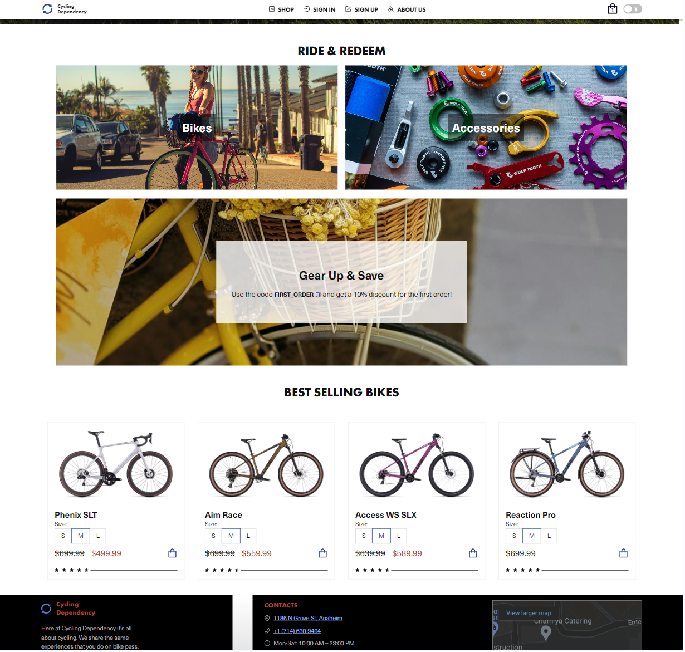

# Cycles Store E-commerce Project 🚴



[](https://playoffthecuff.github.io/eCommerceApp/)
[](https://opensource.org/licenses/MIT)
[](#authors)

This is an educational project for an online store as part of the educational program ["JS / Front-end RU"](https://rs.school/) by Rolling Scopes School. This repository contains the source code for a cycles store e-commerce project developed by the `p0grammers Team`.

## 🛍️ [Live Demo](https://playoffthecuff.github.io/eCommerceApp/)

## Project Description

**Cycling Dependency** is an online store for selling cycles and accessories. Our goal is to create a convenient and attractive service for customers to search, browse, and purchase cycling gear. We share the same experiences as you on bike paths, highways, and off-road, and these experiences drive us to create the best gear possible for our worldwide family of cyclists.

## 🚀 Setup and Running

### Requirements

- **Node.js** 14.x or higher
- **Git**

### Installation Steps

```bash
# Clone this repository
$ git clone https://github.com/playoffthecuff/eCommerce-App.git

# Navigate to the project folder
$ cd eCommerce-App

# Install dependencies
$ npm install

# Start the application
$ npm run dev
```

## 🔧 Technologies Used

### Frontend

| Technology       | Icon                                                                                                             |
| ---------------- | ---------------------------------------------------------------------------------------------------------------- |
| **React**        |                        |
| **TypeScript**   |          |
| **Ant Design**   |         |
| **Vite**         |                            |
| **MobX**         |                            |
| **React Router** |  |
| **ESLint**       |                      |
| **Prettier**     |                |
| **Vitest**       |                      |

### Backend

| Technology     | Icon                                                                                                |
| -------------- | --------------------------------------------------------------------------------------------------- |
| **Express**    |      |
| **MongoDB**    |      |
| **Mongoose**   |                 |
| **Bcrypt**     |           |
| **Nodemailer** |  |

## 📜 Useful Commands

| Command            | Description                                 |
| ------------------ | ------------------------------------------- |
| `npm run dev`      | Starts Vite for development                 |
| `npm run build`    | Builds frontend for production              |
| `npm run test`     | Runs tests for frontend using Vitest        |
| `npm run test:ui`  | Runs UI tests using Vitest                  |
| `npm run coverage` | Generates test coverage report using Vitest |
| `npm run prepare`  | Installs Husky in the project directory     |
| `npm run lint`     | Lints files using ESLint                    |
| `npm run lint:fix` | Lints and fixes files using ESLint          |
| `npm run format`   | Formats files using Prettier                |
| `npm run preview`  | Previews the application using Vite         |

## 🌟 Contributing

If you have any suggestions or would like to contribute to this project, please fork the repository and submit a pull request.

## 👥 Authors

- [Katerina Rubchenko](https://github.com/kat2709)
- [Evgenii Artemenko](https://github.com/playoffthecuff)
- [Oleksiy Hrybach](https://github.com/hrybach-oleksiy)

## 📄 License

This project is licensed under the [MIT License](https://opensource.org/licenses/MIT).
